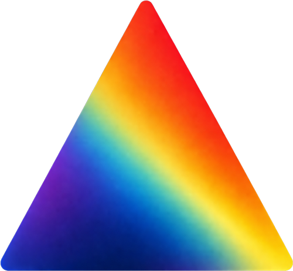

<p align="center">
  
</p>

<h1 align="center">Prism</h1>

<p align="center">
  <a href="https://www.npmjs.com/package/@synthesisengineering/prism">
    
  </a>
  <a href="https://www.npmjs.com/package/@synthesisengineering/prism">
    
  </a>
  
  <a href="https://github.com/synthesiseng/prism/actions">
    
  </a>
  <a href="https://github.com/synthesiseng/prism/blob/main/LICENSE">
    
  </a>
</p>

<p align="center">
  <a href="https://runprism.dev">Docs</a>
</p>

HTML-in-Canvas is coming to browsers. Past the cool demo, it gets messy.
Prism handles the lifecycle so you don't have to.

**Prism is a runtime for managed HTML surfaces inside canvas applications.**

Author visual surfaces with HTML/CSS/SVG. Compose them inside Canvas 2D workflows. Ship data visualizations, design tools, generative art, interactive editors and more.

> **Note:** Native mode requires Chrome Canary with `chrome://flags/#canvas-draw-element` enabled. Prism falls back to a compatibility backend in unsupported browsers.

---

## How It Works

Your app owns the scene, drawing model, animation loop, and state. Prism owns the lifecycle for DOM-authored canvas surfaces — registration, bounds, paint, invalidation, readiness, coordinate helpers, and cleanup.

## Built With Prism

- [Atlantic](https://atlantic.runprism.dev) — North Atlantic tropical cyclone tracker, 2000–2025
- [Composer](https://composer.runprism.dev/) — OG image generator
- [Atelier](https://atelier.runprism.dev/) — Generative type art

## Installation

```sh
pnpm add @synthesisengineering/prism
```

## Agent Skill

Using an AI coding agent? Install the Prism runtime skill:

```sh
npx skills add synthesiseng/prism --skill prism-runtime
```

The skill teaches agents the Prism runtime contract:

- import from the package root: `@synthesisengineering/prism`
- register HTML/CSS/SVG DOM nodes as surfaces
- draw surfaces inside `onPaint()`
- wait for `document.fonts.ready` and `runtime.paintOnce()` before export
- avoid `html2canvas`, `dom-to-image`, raw `drawElementImage()`, and deep imports

Source: [`skills/prism-runtime/SKILL.md`](skills/prism-runtime/SKILL.md).

## Quickstart

```ts
import { CanvasRuntime } from "@synthesisengineering/prism";

const runtime = new CanvasRuntime(canvas, { backend: "auto" });
runtime.start();
```

Register surfaces when you need them:

```ts
const surface = runtime.registerSurface(element, {
  bounds: { x: 0, y: 0, width: 1200, height: 630 }
});

runtime.onPaint(({ drawSurface }) => {
  drawSurface(surface);
});
```

## Export Readiness

Use `paintOnce()` to wait for one complete paint pass before exporting:

```ts
await document.fonts.ready;
await runtime.paintOnce();

const blob = await new Promise<Blob | null>((resolve) => {
  canvas.toBlob(resolve, "image/png");
});
```

## Backend Modes

Prism prefers native HTML-in-Canvas and falls back automatically:

```ts
new CanvasRuntime(canvas, { backend: "auto" }); // default
new CanvasRuntime(canvas, { backend: "native" }); // native only
new CanvasRuntime(canvas, { backend: "fallback" }); // compatibility only
```

```ts
if (runtime.backendKind !== "native") {
  console.warn("Compatibility mode is lower fidelity.");
}
```

The fallback backend is lower fidelity. Native is the target.

## Coordinate Spaces

Surface bounds and input coordinates use CSS pixels. Direct drawing inside `onPaint()` uses canvas backing-store pixels.

Use runtime helpers when aligning manual canvas drawing with surface coordinates:

```ts
runtime.onPaint(({ ctx, drawSurface }) => {
  drawSurface(surface);

  const size = runtime.cssLengthToCanvasPixels(24);
  ctx.fillRect(0, 0, size, size);
});
```

Helpers: `clientToCanvasPoint()` · `cssLengthToCanvasPixels()` · `cssPointToCanvasPixels()`

## Surface Lifecycle

```ts
// Register
const surface = runtime.registerSurface(element, {
  bounds: { x: 0, y: 0, width: 320, height: 180 }
});

// Update bounds
surface.setBounds({ x: 24, y: 32, width: 360, height: 220 });

// Remove
runtime.unregisterSurface(surface);
// or
surface.dispose();

// Destroy runtime
runtime.destroy();
```

## API

```ts
import { CanvasRuntime } from "@synthesisengineering/prism";
import type {
  CanvasBackendKind,
  CanvasBackendPreference,
  CanvasPoint,
  CanvasRuntimeOptions,
  CanvasSurface,
  PaintHandler,
  SurfaceBoundsInput,
  SurfaceOptions,
  UpdateHandler
} from "@synthesisengineering/prism";
```

### CanvasRuntime

```ts
new CanvasRuntime(canvas, options);
```

**Options:** `backend: "auto" | "native" | "fallback"`

**Properties:** `canvas` · `width` · `height` · `pixelRatio` · `backendKind`

**Methods:** `registerSurface()` · `unregisterSurface()` · `onUpdate()` · `onPaint()` · `invalidate()` · `paintOnce()` · `start()` · `stop()` · `destroy()` · `clientToCanvasPoint()` · `cssLengthToCanvasPixels()` · `cssPointToCanvasPixels()`

### CanvasSurface

Returned by `registerSurface()`. Do not construct directly.

**Properties:** `element` · `isDisposed`

**Methods:** `getBounds()` · `setBounds()` · `dispose()`

## Considerations

- Native HTML-in-Canvas is experimental.
- Fallback mode is compatibility-only, lower fidelity, and not equivalent to native HTML rendering.
- `onPaint()` and `onUpdate()` are additive. Each call registers another handler; it does not replace previous handlers.
- `invalidate()` schedules another Prism-owned paint pass when app-owned state changes outside Prism APIs.
- `paintOnce()` works without `start()`. It waits for one runtime-owned paint pass and does not export image data itself.
- Destroying a runtime disposes its registered surfaces. Disposed surfaces report `isDisposed === true`; `getBounds()` and `setBounds()` throw.
- Surface bounds and input coordinates use CSS pixels.
- Direct `ctx` drawing uses canvas backing-store pixels.
- Undrawn surfaces are inactive for pointer and focus handling until they are drawn again.

## Limitations

- Native mode depends on browser support for HTML-in-Canvas.
- The fallback backend is lower fidelity than native HTML rendering.
- Prism v1 is 2D-first.
- WebGL/WebGPU integrations are future-facing.

## Development

```sh
pnpm install
pnpm typecheck
pnpm test
pnpm e2e
pnpm lint
pnpm build
```

## Platform Credit

Prism is built around the [HTML-in-Canvas proposal](https://github.com/WICG/html-in-canvas) and related WICG standards work. All credit for the underlying platform capability goes to the proposal authors and the WICG.

## License

MIT © [Synthesis](https://synthesis.engineering)
